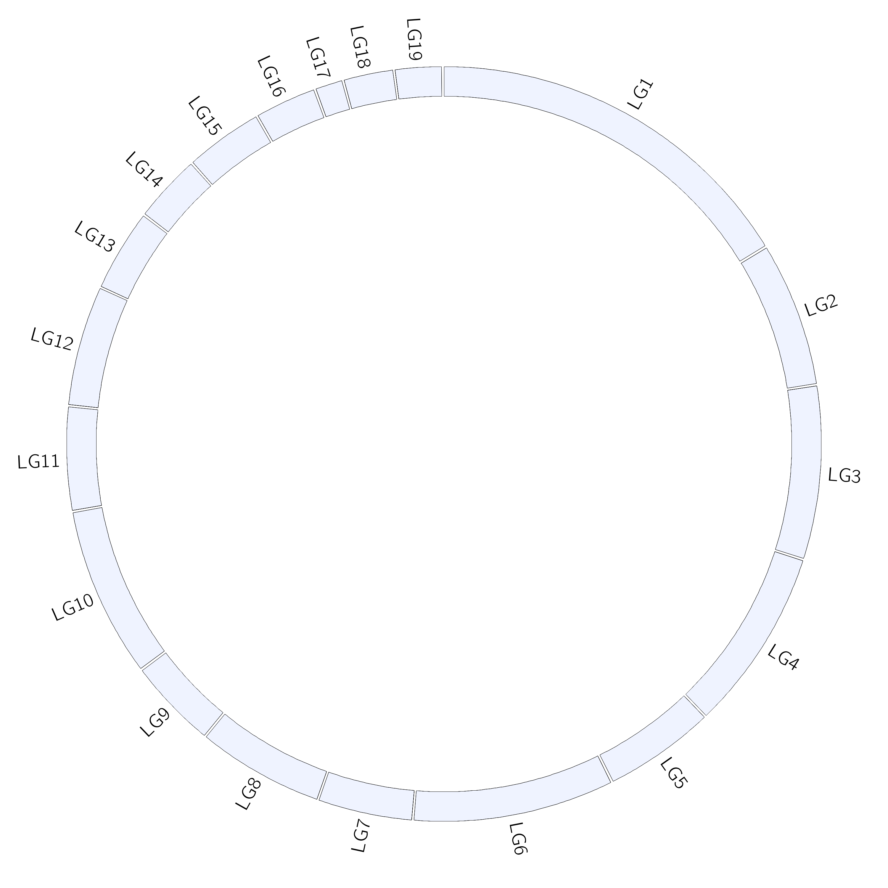
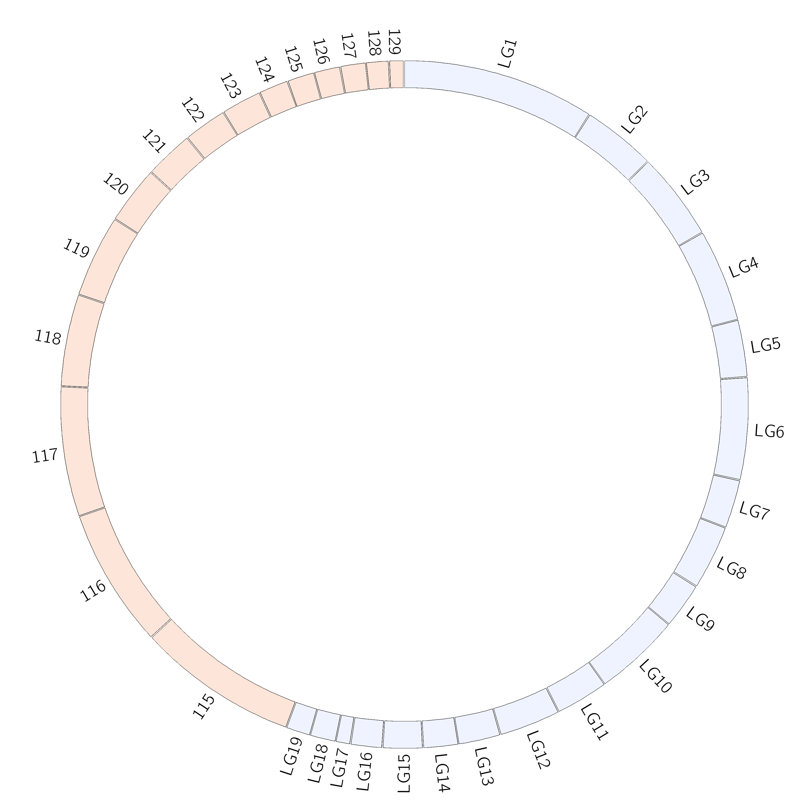

Commands to generate Karyotype file:
```
awk '{print "chr - "$1" "$1" 0 "$2" white"}' BlacSF5_v8.5_NotSubmitted.fasta.fai > BlacKaryotype.txt
```
This can then be plotted on it's own by adding the corresponding text to a file called circos.conf.\
The file can be called something else as long as you eventually direct circos to it. For the first example it is called circos_1Karyotype.conf
```
$ cat circos_1Karyotype.conf
karyotype = BlacKaryotype.txt
chromosomes_units = 100000
track_width = 0.05
track_pad   = 0.01
track_start = 0.98

<<include colors_fonts_patterns.conf>>
<<include housekeeping.conf>>

# IMAGE
<image>
<<include image.conf>>
</image>

<ideogram>
<spacing>
default = 1u
break = 1u
</spacing>
radius           = 0.85r
#Vary to modify size of plot
#chromosomes_radius = 0.9r
thickness        = 100p
#Vary to modify size of ideograms
fill             = yes
stroke_color     = black
stroke_thickness = 1p
show_label       = yes
label_radius     = 1.02r
label_size       = 48p
label_parallel   = no
</ideogram>
```
Running circos with this configuration file will produce the following plot
```
circos -conf circos_1Karyotype.conf
```


Multiple karyotype files can be specified by listing them on the same line. See `circos_2Karyotype.conf` for an example:
```
$ diff circos_1Karyotype.conf circos_2Karyotype.conf
1c1
< karyotype = BlacKaryotype.txt
---
> karyotype = BlacKaryotype.txt,PsojKaryotype.txt
```
Now using this file for plotting will produce the following image.
```
circos -conf circos_2Karyotype.conf
```

Note if you did not rename the results of the first run, then the second run will overwrite these.
