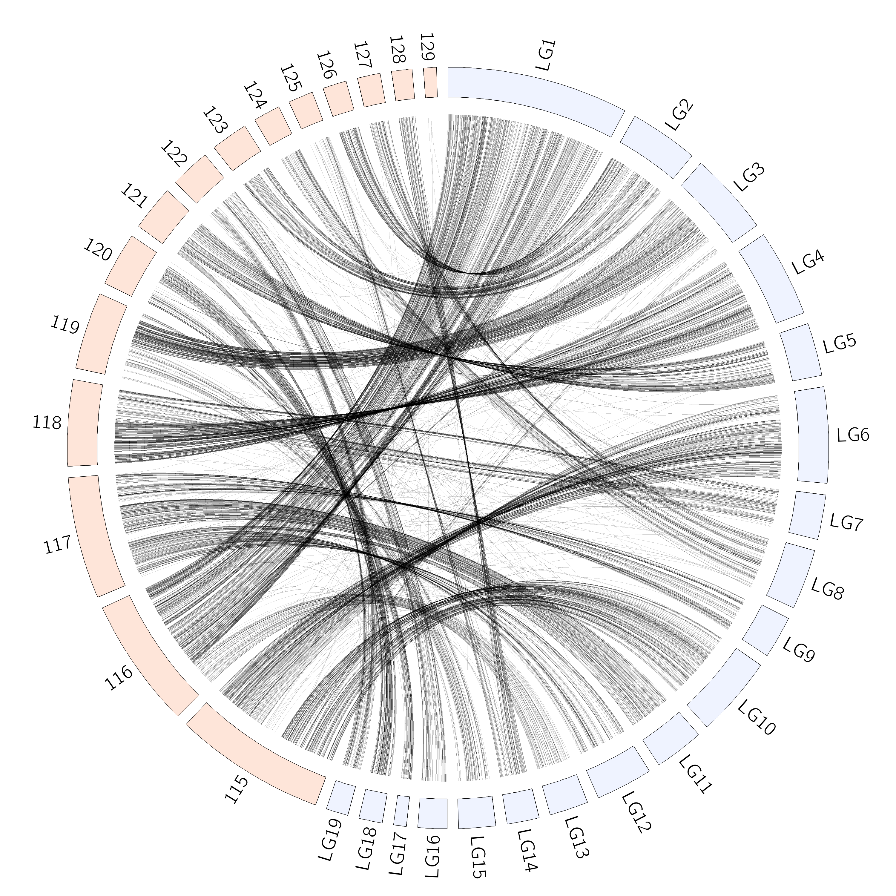
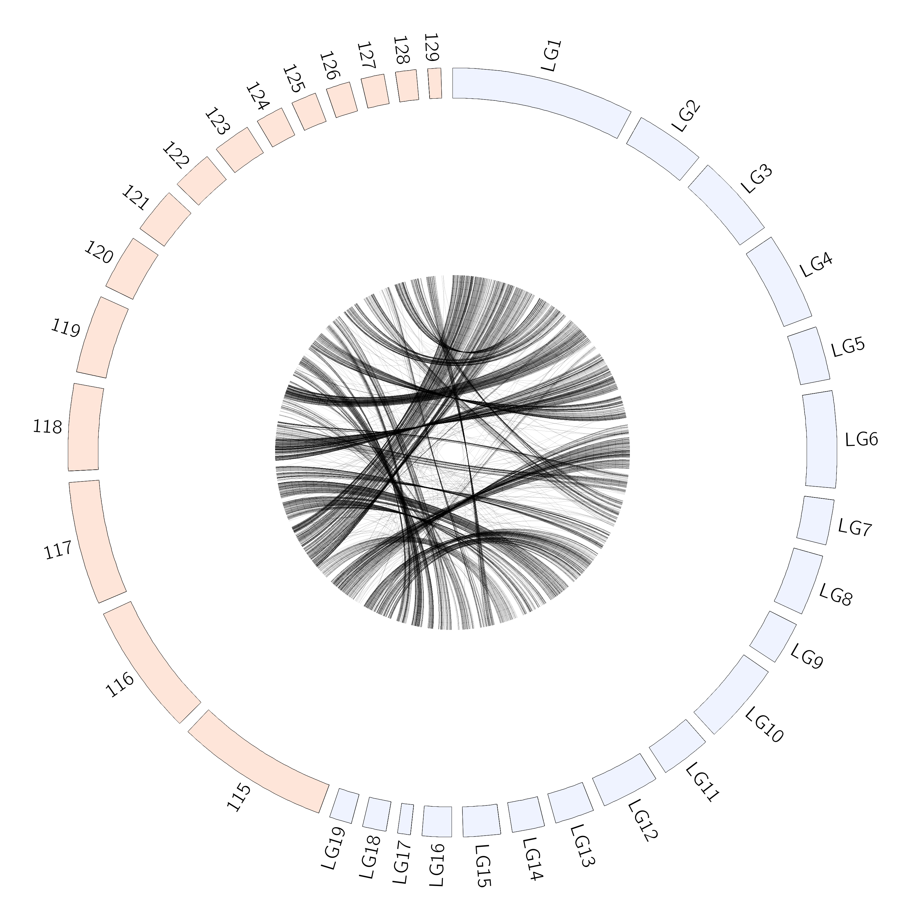
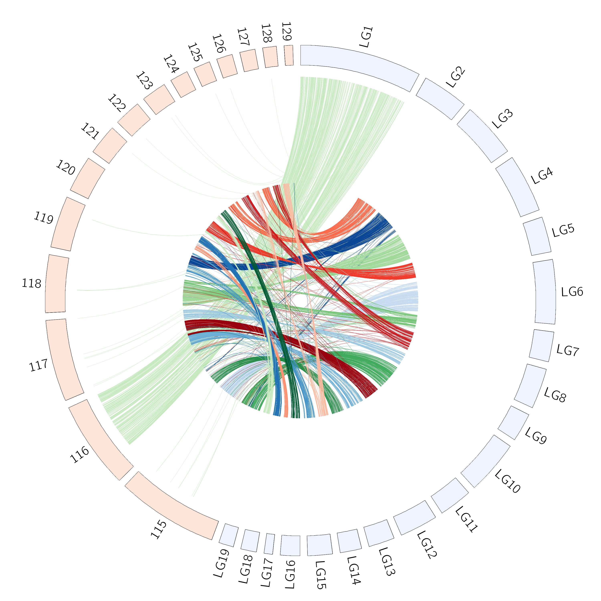

## Plotting links.
Links and any other type of feature can be added to circos plots by modifying the circos conf.
I have already generated a file specifying links `BlacXPsoj.Ribbons.txt`.
```
$ head BlacXPsoj.Ribbons.txt
LG1     10001265        10003407        NW_009258116.1  5484170 5485969
LG1     10040648        10041469        NW_009258116.1  5420919 5421728
LG1     10042112        10043709        NW_009258116.1  5427849 5429407
LG1     10076827        10077255        NW_009258116.1  5424862 5425272
LG1     1008577 1011804 NW_009258116.1  11302113        11304212
LG1     10113464        10115787        NW_009258116.1  5267473 5269003
LG1     10114844        10116046        NW_009258116.1  5269164 5270042
LG1     1014153 1015235 NW_009258116.1  11295267        11296929
LG1     10226828        10231181        NW_009258116.1  5335444 5336649
LG1     10231235        10235254        NW_009258116.1  5351164 5355769
```

By specifying this file in the configuration file and running circos a plot will be generated with links all of the same color.
```
$ diff circos_2Karyotype.conf circos_Black.conf
11a12
> #angle_offset* = -90
17,18c18,22
< default = 1u
< break = 1u
---
> default = 10u
> break = 10u
33a38,47
>
> <links>
> <link>
> file = BlacXPsoj.Ribbons.txt
> color         = black_a5
> radius        = 0.95r
> bezier_radius = 0.1r
> thickness     = 1
> </link>
> </links>
```
Note that there is a new links block which defines the links. I have also modified some other values to make the plot neater.
```
circos -conf circos_Black.conf
```


## Different radius

By changing the radius value, you can change the size of the links plotted. This might be useful if you want to include other information.
```
$ diff circos_Black.conf circos_Black_smallRadius.conf
40c40
< radius        = 0.95r
---
> radius        = 0.5r
```


```
circos -conf circos_Black_smallRadius.conf
```



## Different colors

If you want different colours then that is specified per block. Therefore you need to have multiple `<link>` blocks within one `<links>`
```
<links>
<link>
file = Alignments/BlacLG1xPsoj.txt
color         = vlgreen
radius        = 0.95r
bezier_radius = 0.1r
thickness     = 1
</link>
<link>
file = Alignments/BlacLG2xPsoj.txt
color         = red
radius        = 0.95r
bezier_radius = 0.1r
thickness     = 1
</link>
...
...
...<\links>
```
This is available in `circos_BlacColor.conf`
Plotting this produces a colourful circos plot
```
circos -conf circos_BlacColor.conf
```

In the above, each `<link>` block contains a radius and bezier_radius value that is the same. These could instead be provided in the `<links>` block:
```
<links>
radius        = 0.95r
bezier_radius = 0.1r
<link>
file = Alignments/BlacLG1xPsoj.txt
color         = vlgreen
thickness     = 1
</link>
<link>
file = Alignments/BlacLG2xPsoj.txt
color         = red
thickness     = 1
</link>
...
...
...<\links>
```
They will then be inherited by each value.

## Plotting different radius per scaffold.
It is possible to provide different radius per scaffold. Providing a global radius in `<links>`, but then overwriting in one `<link>` block is possible:
<links>
radius        = 0.5r
bezier_radius = 0.1r
<link>
file = Alignments/BlacLG1xPsoj.txt
color         = vlgreen
thickness     = 1
radius        = 0.95
</link>
<link>
file = Alignments/BlacLG2xPsoj.txt
color         = red
thickness     = 1
</link>
...
...
...<\links>
```


```
circos -conf circos_DifferentRadius.conf
```


