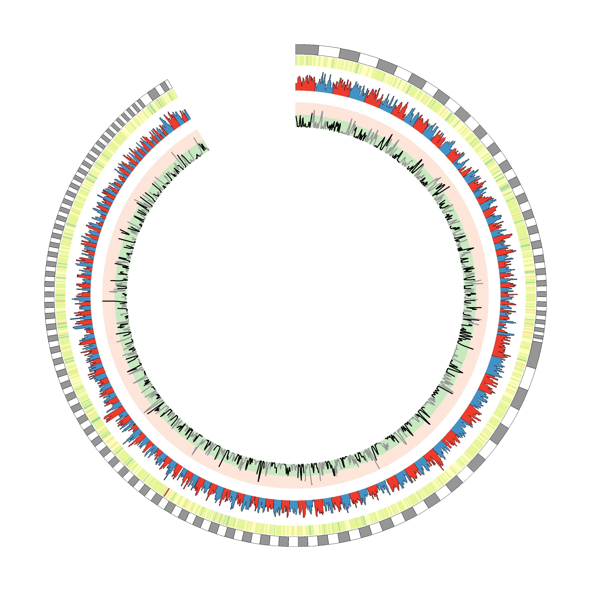

## Introuction
Typically, when plotting this type of data one will break the genome up into bins and plot a value per bin. The size of the bins is dependent on the size of the genome assembly. Instructions for this will follow soon.

## Plotting.
Files for plotting should define the scaffold, start coordinate, end coordintate and value to plot in four columns:
```
#Scaffold	Start	End	Value
Pdest_CA_v0.1-1	0	20000	0.5437
Pdest_CA_v0.1-1	10000	30000	0.5194
Pdest_CA_v0.1-1	20000	40000	0.515
Pdest_CA_v0.1-1	30000	50000	0.51205
Pdest_CA_v0.1-1	40000	60000	0.50725
Pdest_CA_v0.1-1	50000	70000	0.5032
```
Note, the first line isn't required. It is ignored as it beings with a `#`.

## Karyotype.
The Karyotype is the same as previous, but as we are using a different, more fragmented assembly, I wanted to reintroduce it. This time, the colors in the final column alternate:
```
circos -conf Karyotype1.conf
```

You will note that we have removed the labels, to prevent overplotting. Yu can compare `Karyotype1.conf` with previous configurations files to see how.
While this plot is adequatem it might be useful to have a break in the circle. This would allow space to add labels. This can be done by adding a `<pairwise>` block:
```
<pairwise Pdest_CA_v0.1-1 Pdest_CA_v0.1-823>
spacing=20u
</pairwise>
```

```
circos -conf Karyotype2.conf
```


## Heatmaps.
For this example we will plot an AT content heatmap. The frequency of AT bases is defined in the 4th column of `AT.txt`.\
Heatmaps, as well as line graphs and histograms are defined within the `<plots>` block:
```
<plots>
<plot>
color      = spectral-9-div
type       = heatmap
file = AT.txt
r0   = 0.955r  #Defines radial position of minimum
r1   = 0.995r  #Defines radial position of maximum
min  = 0.4     #Defines minimal y value to plot
max  = 0.6     #Defined maximal y value to plot
</plot>
</plots>
```

```
circos -conf AT_Heatmap.conf
```


The position and thickness of the heatmap can be changed by modifying r0 and r1"
```
$ diff AT_Heatmap.conf AT_HeatmapMod.conf
47,48c47,48
< r0   = 0.955r
< r1   = 0.995r
---
> r0   = 0.5r
> r1   = 0.75r
```

```
circos -conf AT_HeatmapMod.conf
```


I prefer the first one so will add other plots to that.

## Histograms
Histograms are added to the same `<plots>` block as heatmaps, by adding a second `<plot>` block. For this plot, I am plotting gene counts from `GenesPerWindow.txt`. 
```
<plots>
<plot>
color      = spectral-9-div
type       = heatmap
file = AT.txt
r0   = 0.955r
r1   = 0.995r
min  = 0.4
max  = 0.6
</plot>
<plot>
type=histogram #Note the different plot type
file = GenesPerWindow.txt
extend_bin=no
fill_color = grey
min = 0
max = 17
r0 = 0.85r
r1 = 0.95r
</plot>
</plots>
```
Plotting this:
```
circos -conf GeneCount_Histo.conf
```

However, I think there is value to being able to tell scaffolds from one another, possibly by plotting them in alternate colors. I do this by splitting my input file into two parts, plotting them on the same plane (defined by r0 and r1):
```$ diff GeneCount_Histo.conf GeneCount_Histo2.conf
54c54
< file = GenesPerWindow.txt
---
> file = GenesPerWindow1.txt
56c56,66
< fill_color = grey
---
> fill_color = dred
> min = 0
> max = 17
> r0 = 0.85r
> r1 = 0.95r
> </plot>
> <plot>
> type=histogram
> file = GenesPerWindow2.txt
> extend_bin=no
> fill_color = dblue
```
Again, the width of the plot can be altered by increasing the difference between r0 and r1. 
```
circos -conf GeneCount_Histo2.conf
```


## Line graphs

Again, line is a type of plot which can be added to the `<plots>` block as an additional `<plot>`. For this block I am plotting repeat density. I have already split it so lines of alternate scaffolds differ in colors.
```
<plot>
type = line
file = RepeatDensity1.txt
r0 = 0.7r
r1 = 0.8r
min = 0
max = 1
thickness = 5
color = black
</plot>
<plot>
type = line
file = RepeatDensity2.txt
r0 = 0.7r
r1 = 0.8r
min = 0
max = 1
thickness = 5
color = grey
</plot>
```

```
circos Linegraph.conf
```


For clarity, I like to shade the background of line plots. This can be done by adding a `<backgrounds>` block within the `<plot>` block. It only needs to go in one of the plot blocks, defined on the plane.
```
<plot>
type = line
file = RepeatDensity2.txt
r0 = 0.7r
r1 = 0.8r
min = 0
max = 1
thickness = 5
color = grey
<backgrounds>
<background>
color = vvlred
y0 = 0.5
</background>
<background>
color = vlgreen
y1 = 0.5
</background>
</backgrounds>
</plot>
</plots>
```

```
circos Linegraph2.conf
```

